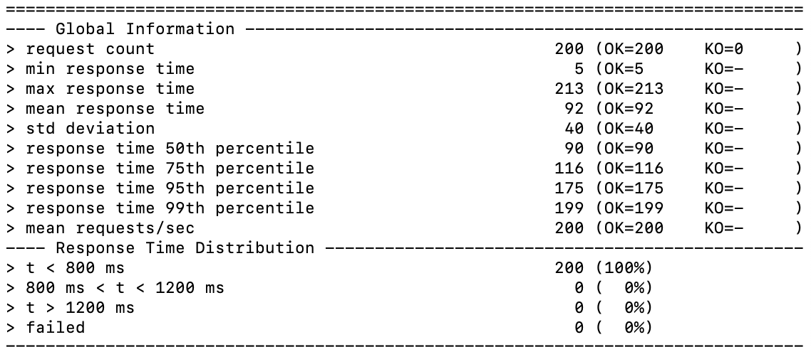

# 大作业报告
#### 许嘉禾 191220135

### 一、基本功能展示
因为一直没空去学前端相关技术，也没看明白怎么对示例的bookstore项目进行扩展，最后就只交了实现了后端逻辑的POS项目。以下示例操作均在postman中进行：

首先分别启动pos-discovery, pos-gateway, pos-product, pos-cart, pos-order, pos-delivery这六个微服务，然后启动docker，运行./start-server.sh，启动rabbitmq的消息通道（此与aw07的示例一致，用于下单时的消息驱动），接着就可以通过在postman中发出请求来运行整个系统。

首先创建一个购物车

然后浏览商品页面

选择其中一个商品的数据体，作为post命令的body部分，发送请求，向购物车添加该商品

查看当前购物车内总价

结算

此时后台已自动生成一个订单与一个运单

查看运单信息

查询某一运单信息

再次查询该运单信息，发现运单状态从DELIVERING变为REACHED（我设计的运单状态由查询次数决定）

### 二、性能测试
#### 1. 全部商品的缓存
商品信息是参照aw04的实现从京东的网站爬取，因此第一次获取商品信息时会响应比较慢，有时甚至会出现gateway timeout的情况。如下图就花了189ms的响应时间：

但用了spring cache的技术，从第二次开始的查询都是从缓存中获取商品信息，响应时间基本在10ms左右。

#### 2. 响应式对性能的提升
在gatling中模拟100个用户创建购物车和查询购物车的操作，首先对非响应式的aw07进行测试，结果如下：

然后对本响应式的项目进行测试，结果如下：

可以看到性能是有一定提升的。

再重复允许一次，结果如下：

性能大幅提升，这应该是缓存的作用。

### 三、关于响应式的一些讨论
从代码实现角度，将系统改造为响应式主要是应用了spring的Reactive Stack这个技术栈，将原来的对象抽象为“流”：单个对象改成Mono，List对象改成Flux，通过对流中对象的各种转换完成相应的功能。另外，原来用于微服务间发送请求的restTemplate要换成webClinet。

对流的操作具有异步性，在对Mono或Flux作转换的时候，cpu可以另外执行别的工作，也就是无需等Mono或Flux的转换操作返回就可接着执行下面代码，这样大大提高了cpu的利用率，也就提高了整个系统的响应速度。restTemplate的改造也是这个道理，原来的restTemplate是一种阻塞式的请求，要等到请求的站点响应完成后才能接着执行下面的代码，而webClinet则是非阻塞式的，在等待响应的这段时间里cpu可以执行其他的操作。